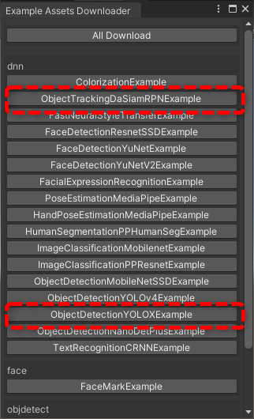
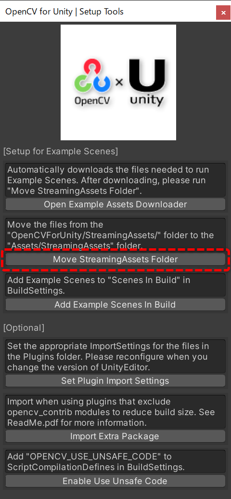
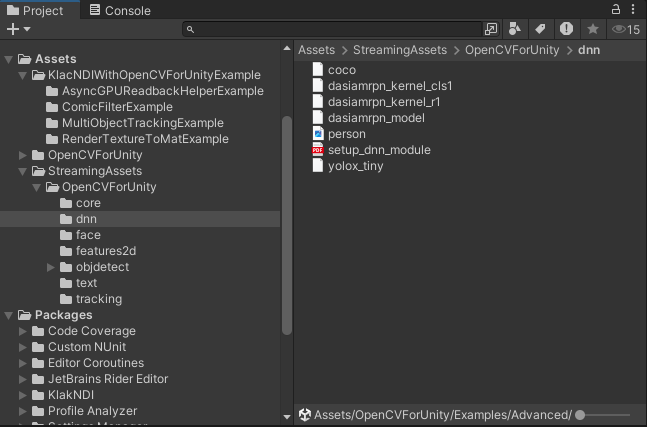
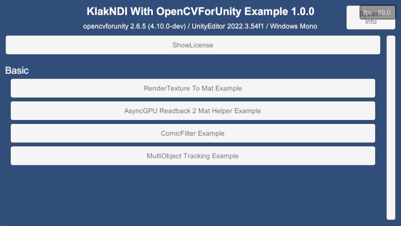
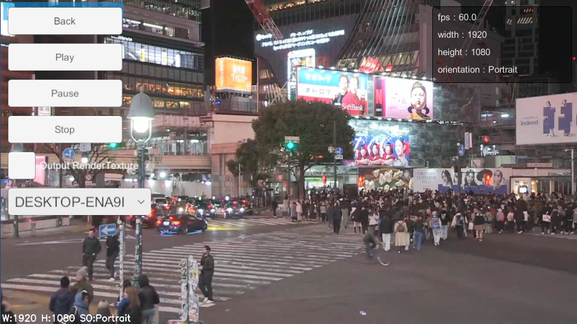
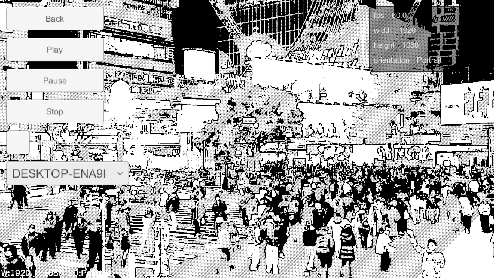

# KlacNDI With OpenCVForUnity Example

## Overview
- Integrate "KlacNDI" with "OpenCV for Unity".
- This is an example of using klakNDI to receive a video stream delivered by the NDI protocol, convert it to the OpenCV Mat class and apply image processing.

## Environment
- Windows / macOS / Linux / Android / iOS
- Unity >= 2022.3.54f1+
- Scripting backend MONO / IL2CPP
- [OpenCV for Unity](https://assetstore.unity.com/packages/tools/integration/opencv-for-unity-21088?aid=1011l4ehR) 2.6.5+
- [KlacNDI](https://github.com/keijiro/KlakNDI)

## Setup
1. Download the latest release unitypackage. [KlacNDIWithOpenCVForUnityExample.unitypackage](https://github.com/EnoxSoftware/KlacNDIWithOpenCVForUnityExample/releases)
1. Create a new project. (KlacNDIWithOpenCVForUnityExample)
1. Import and Setup [OpenCV for Unity](https://assetstore.unity.com/packages/tools/integration/opencv-for-unity-21088?aid=1011l4ehR).
    * Download Dnn model files by ExampleAssetsDownloader.
    
    * Move the files from the "OpenCVForUnity/StreamingAssets/" folder to the "Assets/StreamingAssets" folder.
    
1. Import and Setup [KlacNDI](https://github.com/keijiro/KlakNDI).
1. Import [KlacNDIWithOpenCVForUnityExample.unitypackage](https://github.com/EnoxSoftware/KlacNDIWithOpenCVForUnityExample/releases).
1. Add the "Assets/KlacNDIWithOpenCVForUnityExample/*.unity" files to the "Scenes In Build" list in the "Build Settings" window.
1. Build and Deploy.
    

## ScreenShot

