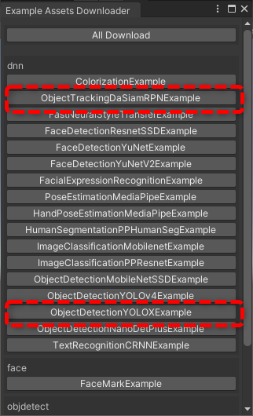
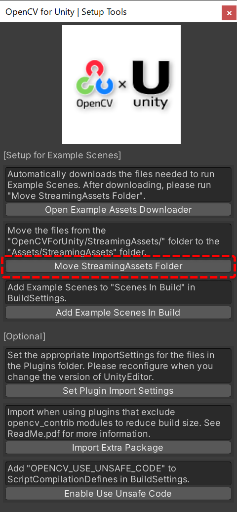
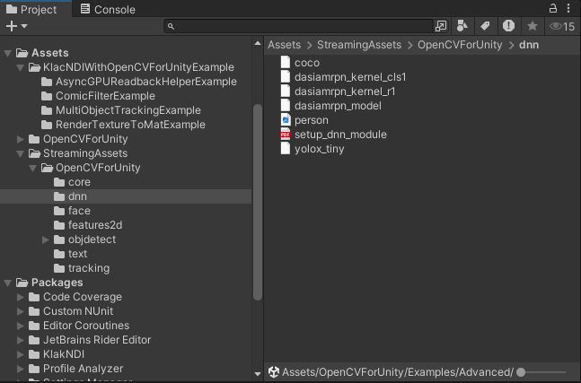
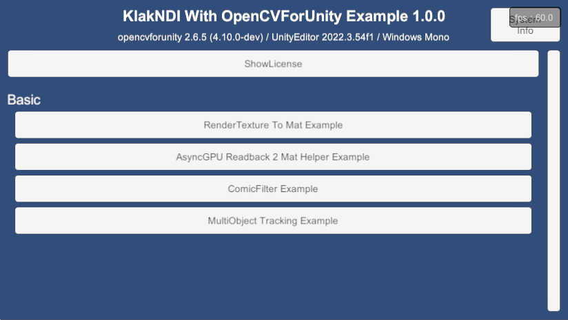
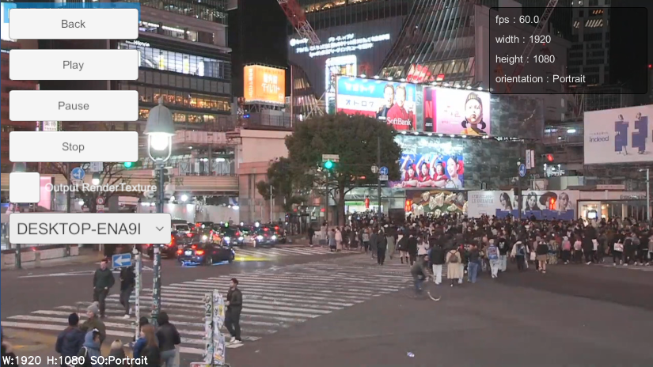
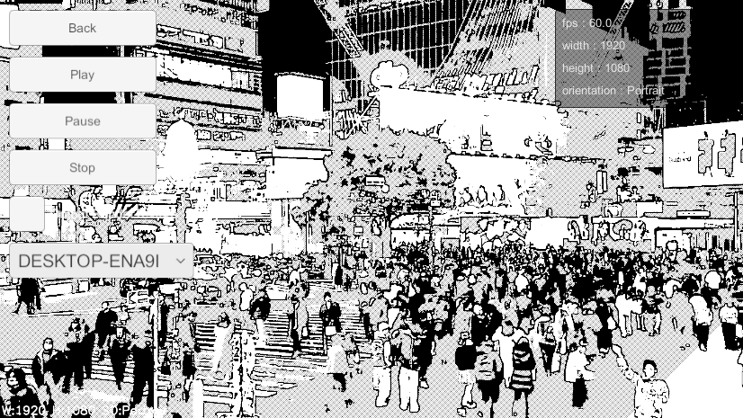
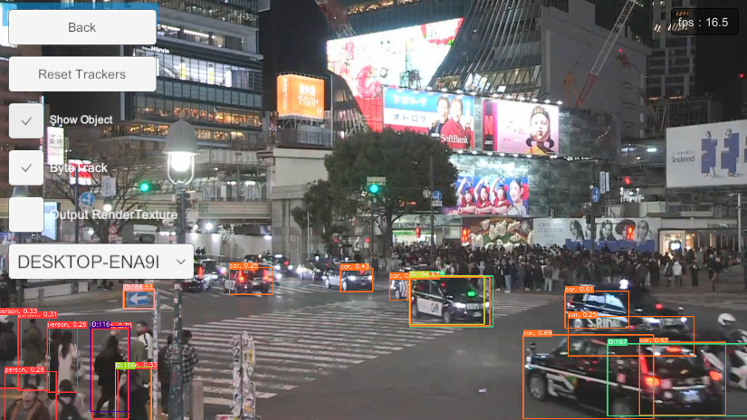

# KlakNDI With OpenCVForUnity Example

YouTube Live --> [OBS Studio](https://obsproject.com/) + [DistroAV](https://github.com/DistroAV/DistroAV) --> [KlakNDI](https://github.com/keijiro/KlakNDI) --> [OpenCV for Unity](https://assetstore.unity.com/packages/tools/integration/opencv-for-unity-21088?aid=1011l4ehR)

## Overview

- Integrate **[KlakNDI](https://github.com/keijiro/KlakNDI)** with **[OpenCV for Unity](https://assetstore.unity.com/packages/tools/integration/opencv-for-unity-21088?aid=1011l4ehR)**.
- This is an example of using [KlakNDI](https://github.com/keijiro/KlakNDI) to receive a video stream delivered by **[NDI](https://ndi.video/)**®, convert it to **OpenCV**'s `Mat` class, and apply image processing.

## Environment

- **Windows** / **macOS** / **Linux** / **Android** / **iOS**
- **Unity 2022.3.62f3+**
- **Scripting Backend**: **Mono** / **IL2CPP**
- [OpenCV for Unity](https://assetstore.unity.com/packages/tools/integration/opencv-for-unity-21088?aid=1011l4ehR) **3.0.4+**
- [KlakNDI](https://github.com/keijiro/KlakNDI)

## Setup

1. Download the latest release unitypackage from [KlakNDIWithOpenCVForUnityExample.unitypackage](https://github.com/EnoxSoftware/KlakNDIWithOpenCVForUnityExample/releases).
2. Create a new project. *(ex. KlakNDIWithOpenCVForUnityExample)*
3. Import and Setup [OpenCV for Unity](https://assetstore.unity.com/packages/tools/integration/opencv-for-unity-21088?aid=1011l4ehR).
    - Download **Dnn** model files by `Example Assets Downloader` window.  
      
    - Move the files from the `Assets/OpenCVForUnity/StreamingAssets` folder to the `Assets/StreamingAssets` folder.  
      
4. Import and Setup [KlakNDI](https://github.com/keijiro/KlakNDI).
5. Import [KlakNDIWithOpenCVForUnityExample.unitypackage](https://github.com/EnoxSoftware/KlakNDIWithOpenCVForUnityExample/releases).
6. Add all of the `***.unity` files in the `KlakNDIWithOpenCVForUnityExample` folder to `Build Settings` → `Scenes In Build`.
7. Build and Deploy.  
    

## ScreenShot

