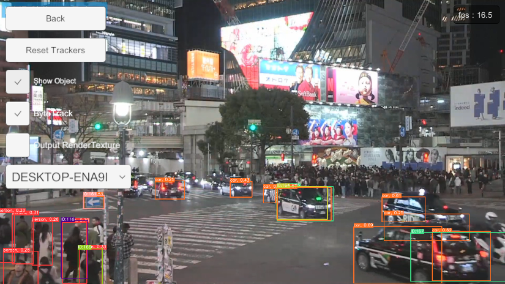

# KlakNDI With OpenCVForUnity Example

YouTube Live --> [OBS Studio](https://obsproject.com/) + [DistroAV](https://github.com/DistroAV/DistroAV) --> [KlakNDI](https://github.com/keijiro/KlakNDI) --> [OpenCV for Unity](https://assetstore.unity.com/packages/tools/integration/opencv-for-unity-21088?aid=1011l4ehR)

## Overview
- Integrate "[KlakNDI](https://github.com/keijiro/KlakNDI)" with "[OpenCV for Unity](https://assetstore.unity.com/packages/tools/integration/opencv-for-unity-21088?aid=1011l4ehR)".
- This is an example of using [KlakNDI](https://github.com/keijiro/KlakNDI) to receive a video stream delivered by [NDI](https://ndi.video/)®, convert it to the OpenCV Mat class and apply image processing.

## Environment
- Windows / macOS / Linux / Android / iOS
- Unity >= 2022.3.54f1+
- Scripting backend MONO / IL2CPP
- [OpenCV for Unity](https://assetstore.unity.com/packages/tools/integration/opencv-for-unity-21088?aid=1011l4ehR) 2.6.5+
- [KlakNDI](https://github.com/keijiro/KlakNDI)

## Setup
1. Download the latest release unitypackage. [KlakNDIWithOpenCVForUnityExample.unitypackage](https://github.com/EnoxSoftware/KlakNDIWithOpenCVForUnityExample/releases)
1. Create a new project. (KlakNDIWithOpenCVForUnityExample)
1. Import and Setup [OpenCV for Unity](https://assetstore.unity.com/packages/tools/integration/opencv-for-unity-21088?aid=1011l4ehR).
    * Download Dnn model files by ExampleAssetsDownloader.     
           
    * Move the files from the "OpenCVForUnity/StreamingAssets/" folder to the "Assets/StreamingAssets" folder.      
            
1. Import and Setup [KlakNDI](https://github.com/keijiro/KlakNDI).
1. Import [KlakNDIWithOpenCVForUnityExample.unitypackage](https://github.com/EnoxSoftware/KlakNDIWithOpenCVForUnityExample/releases).
1. Add the "Assets/KlakNDIWithOpenCVForUnityExample/*.unity" files to the "Scenes In Build" list in the "Build Settings" window.
1. Build and Deploy.   
   

## ScreenShot

